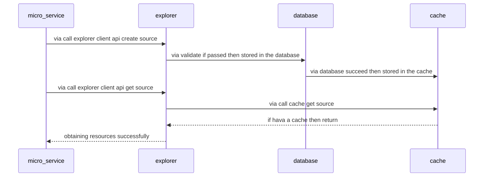

## 1. What is an explorer
- Explorer Managing resources ex：microservice,database,cache,log...

### 2. Architecture diagram



### 3. How to use
> Examples for mysql： looks like... 👇
> /mysql_db/table/schemas

```protobuf
// Currently supported
enum ResourceGroupType {
    DB = 0;
    Cache = 1;
}

enum ResourceType{
    MYSQL = 1;
    CLICKHOUSE = 2;
}
```
```json
// explorer/resources/${id}
{
    "resource_id":"1",
    "resource_name":"${svc}-mysql",
    "resource_type":"mysql",
    "resouce_group_id":"1",
    "resource_group_name":"Database-Mysql",
    "resource_group_type":"Database",
    "resource_structure":{
        "resource_parent":"",
        "resource_child":"",
        "resource_schema":[{
            "resource_schema_key":"",
            "resource_schema_value":""
        }]
    },
    "resource_effect":"resource_effect"
}
```

```go
type Resource struct {
	ResourceID        string            `json:"resource_id"`        
	ResourceName      string            `json:"resource_name"`      
	ResourceType      string            `json:"resource_type"`      
	ResouceGroupID    string            `json:"resouce_group_id"`   
	ResourceGroupName string            `json:"resource_group_name"`
	ResourceGroupType string            `json:"resource_group_type"`
	ResourceStructure ResourceStructure `json:"resource_structure"` 
	ResourceEffect    string            `json:"resource_effect"`    
}

type ResourceStructure struct {
	ResourceParent string           `json:"resource_parent"`
	ResourceChild  string           `json:"resource_child"` 
	ResourceSchema []ResourceSchema `json:"resource_schema"`
}

type ResourceSchema struct {
	ResourceSchemaKey   string `json:"resource_schema_key"`  
	ResourceSchemaValue string `json:"resource_schema_value"`
}
```

### 4. How to operating resources
```go
```
